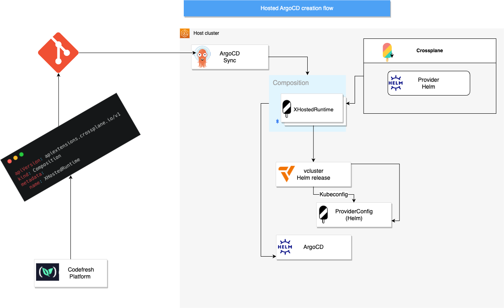

# Using Crossplane to deploy ArgoCD on vcluster

Run your own [k3d](https://k3d.io/) cluster with [Crossplane](https://www.crossplane.io/) and deploy [ArgoCD](https://argoproj.github.io/cd/) instances onto [vclusters](https://www.vcluster.com/)

---
## Requirements to run this demo
1. k3d
2. Helm
---
## What's in this repository?
1. [Initialization script](scripts/init-k3d-demo-env.sh) - deploys k3d cluster and installs ArgoCD onto it. It also applies the [argocd-applications](argocd-applications) to this cluster.
2. [crossplane-resources](crossplane-resources) - Contains the providers required to deploy our virtualargocd composite resource, along with the [definition](crossplane-resources/xvirtualargocd/definition.yaml) and the [composition](crossplane-resources/xvirtualargocd/composition.yaml)
3. [virtualargocds](virtualargocds) - contains the composite resource claims. Here we will define all instances of the composition to be created.
4. [argocd-applications](argocd-applications) - contains ArgoCD applications so that ArgoCD syncs it all to the cluster. One of the ArgoCD appplications deploys crossplane itself to the cluster.
---
## How to run the demo?
1. Fork the repo
2. Replace repository URL in [crossplane-resources.yaml](argocd-applications/crosspalne-resources.yaml) and in [virtual-argocds.yaml](argocd-applications/virtual-argocds.yaml). 
3. Execute [initializtion script](scripts/init-k3d-demo-env.sh).
4. Once all ArgoCD applications are synced, uncomment [customer2.yaml](virtualargocds/customer2.yaml), see that a namespace is created, with vcluster and ArgoCD deployed onto it.